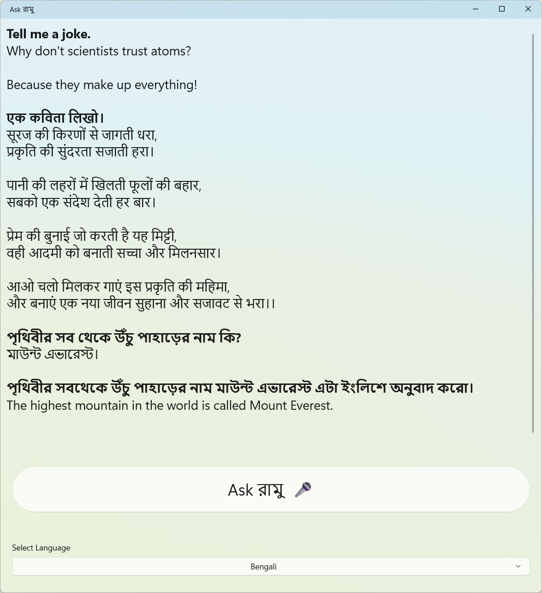

# Ramu: Multilingual Speech-to-Text and AI Assistant (.NET MAUI)

## Overview
Ramu is a cross-platform .NET MAUI application that allows users to record speech in multiple languages, transcribe it using Azure Speech-to-Text, and interact with an AI assistant (powered by Azure OpenAI's GPT-3.5 Turbo). The app supports English, Hindi, Bengali, and Spanish, and dynamically updates the UI based on the selected language.

## Demo

[▶️ Watch the demo video (recording.mp4)](./recording.mp4)



## Features
- Record audio and transcribe speech in multiple languages
- Get AI-powered responses from Azure OpenAI (ChatGPT style)
- Dynamic UI updates for language and assistant name
- Modern, responsive layout with scrollable, formatted conversation history

## Prerequisites
- [.NET 9 SDK](https://dotnet.microsoft.com/en-us/download/dotnet/9.0)
- .NET MAUI workload: `dotnet workload install maui`
- Azure resources:
  - Azure Speech service (get your key and region)
  - Azure OpenAI resource (deploy gpt-35-turbo, get your key and endpoint)
- Visual Studio 2022+ or Visual Studio Code (with C# and MAUI extensions)

## Setup
1. **Clone the repository:**
   ```sh
   git clone <your-repo-url>
   cd ramu
   ```
2. **Configure environment variables:**
   - `AzSpeechKey`: Your Azure Speech API key
   - `AzOpenAIKey`: Your Azure OpenAI API key

   Set these in your system environment or in your IDE's run configuration.

3. **Restore and build:**
   ```sh
   dotnet restore
   dotnet build
   ```

4. **Run the app:**
   ```sh
   dotnet run -f net9.0-windows10.0.19041.0
   # or for Android/iOS/MacCatalyst, use the appropriate target framework
   ```

## Usage
- Select your language at the bottom.
- Click the "Ask Ramu 🎤" button to start/stop recording.
- View transcriptions (bold) and AI responses in the scrollable conversation area.
- The assistant's name and window title update with the selected language.

## Customization
- To add more languages, update the `_languageCodes` dictionary in `MainPage.xaml.cs`.
- To change the assistant's name per language, edit the `AssistantName` value in the tuple.
- To adjust UI layout, edit `MainPage.xaml`.

## License
MIT License
